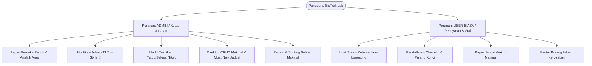

# 📋 DOKUMEN KEPERLUAN PRODUK (PRD)
# SisTrak Lab v3.0 — Sistem Penjejakan & Pengurusan Makmal Komputer

---

## 1. PENGENALAN & LATAR BELAKANG PROJEK

### 1.1 Ringkasan Eksekutif
**SisTrak Lab v3.0** merupakan aplikasi web pengurusan dan pemantauan makmal komputer bersepadu yang dibangunkan khusus untuk institusi pendidikan tinggi (khususnya politeknik dan kolej komuniti). Sistem ini menyelesaikan masalah pengurusan manual penyerahan kunci makmal, ketiadaan visibiliti status ketersediaan makmal dalam masa nyata (*real-time availability*), serta kelewatan aduan kerosakan perkakasan/komputer melalui pendigitalan penuh proses pendaftaran (*check-in/check-out*), semakan jadual waktu, dan modul penyelenggaraan teknikal.

### 1.2 Pernyataan Masalah
1. **Ketidakpastian Ketersediaan Makmal**: Pensyarah dan pelajar sering membazirkan masa mencari makmal kosong kerana tiada maklumat langsung mengenai makmal mana yang sedang digunakan atau sedang diselenggara.
2. **Pengurusan Aduan yang Lambat**: Aduan kerosakan komputer atau projektor sering dibuat secara lisan atau mesej WhatsApp yang bertaburan, menyebabkan Ketua Jabatan dan pegawai teknikal terlepas pandang status kerosakan aset.
3. **Penyelarasan Kunci Tidak Sistematik**: Rekod peminjaman dan pemulangan kunci makmal fizikal yang menggunakan buku log kertas terdedah kepada keciciran dan sukar diaudit.

### 1.3 Objektif Sistem
- Menyediakan papan pemuka (*live dashboard*) yang memaparkan ketersediaan semua 10 makmal rasmi sepintas lalu.
- Mempercepatkan proses pendaftaran masuk makmal (*Check-In*) dalam tempoh bawah 5 saat.
- Membolehkan pengurusan makmal secara CRUD (Cipta, Baca, Sunting, Padam) dan muat naik gambar jadual waktu rasmi bagi setiap makmal.
- Membina saluran aduan teknikal berpusat dengan sistem notifikasi pintar gaya TikTok untuk Ketua Jabatan (Admin).

---

## 2. HIERARKI & PROFIL PENGGUNA (USER ROLES & PERMISSIONS)

Sistem menetapkan dua (2) peranan pengguna utama dengan tahap kebenaran (*permissions*) yang berbeza:



### 2.1 Peranan 1: ADMIN (Ketua Jabatan / Pegawai Makmal Kanan)
| Atribut | Huraian |
|---|---|
| **Profil Contoh** | Ketua Jabatan Teknologi Maklumat & Komunikasi (JTMK) / Pentadbir Makmal |
| **Akses Modul** | Akses penuh ke semua modul (Dashboard, Teknikal, Pengurusan Lab, Profil) |
| **Keistimewaan Utama** | - **Penerimaan Notifikasi Aduan TikTok-Style**: Menerima lencana nombor merah/oren terapung pada menu sidebar apabila aduan baharu dihantar.<br>- **Pengurusan Aduan**: Membuka laci notifikasi, menyemak simptom kerosakan, dan menanda tiket sebagai *Selesai* (`Ditutup`).<br>- **Pengurusan Makmal CRUD**: Mendaftar makmal baharu, menukar aras, mengubah status makmal kepada Diselenggara, memadam makmal secara kekal, dan memuat naik fail gambar jadual waktu rasmi.<br>- **Kawalan Sesi**: Boleh menyemak rekod penggunaan makmal bagi semua pensyarah pada tarikh terpilih. |

### 2.2 Peranan 2: USER BIASA (Pensyarah, Pembantu Makmal & Pelajar)
| Atribut | Huraian |
|---|---|
| **Profil Contoh** | Pensyarah Kanan (Pn. Rohana binti Ismail), Pensyarah Kursus, Wakil Pelajar Amali |
| **Akses Modul** | Akses terhad (Dashboard Semasa, Paparan Jadual, Borang Hantar Aduan) |
| **Keistimewaan Utama** | - **Semakan Status Makmal Masa Nyata**: Mengetahui serta-merta makmal yang berstatus *Tersedia* (dengan lampu hijau menyala kelip-kelip) atau *Digunakan*.<br>- **Pendaftaran Masuk (Check-In)**: Memilih makmal, memasukkan nama, tujuan penggunaan, dan tempoh masa (stepper 30 minit).<br>- **Tamat Sesi (Check-Out)**: Menyerahkan/memulangkan kunci makmal dengan dialog pengesahan mudah.<br>- **Semakan Jadual**: Membuka paparan gambar jadual waktu makmal beresolusi tinggi.<br>- **Penghantaran Aduan Teknikal**: Mengisi borang aduan pantas (*Aduan*) jika mendapati komputer, pendingin hawa, atau kabel LAN rosak. |

---

## 3. SPESIFIKASI CIRI KHAS: SISTEM NOTIFIKASI TIKTOK-STYLE (UNTUK ADMIN)

Bagi memastikan Ketua Jabatan (Admin) sentiasa maklum tentang sebarang isu perkakasan tanpa perlu memuat semula halaman secara manual, sistem dilengkapi dengan **Sistem Notifikasi Lencana Angka Terapung (TikTok-Style Badge Notification)**:

### 3.1 Reka Bentuk Visual Lencana (Badge Counter)
1. **Posisi & Rupa**:
   - Diletakkan di sudut atas-kanan ikon atau teks menu **"Teknikal"** pada bar navigasi sisi (*sidebar*).
   - Bentuk kapsul/bulatan kecil berwarna merah terang (`bg-rose-500` atau gradient merah-oren TikTok), tulisan nombor putih tebal (`text-[10px] font-black text-white`), dan bersempadan putih halus (`ring-2 ring-white`).
   - Memaparkan nombor aduan baharu yang belum diambil tindakan: `1`, `2`, `3`, ..., sehingga `99+`.
2. **Kesan Animasi**:
   - Setiap kali aduan baharu diterima, lencana akan membuat animasi lompat/denyut (*pulse bounce pop-in*) untuk menarik perhatian Admin serta-merta.

### 3.2 Interaksi & Tingkah Laku Panel Notifikasi
```
┌────────────────────────────────────────────────────────┐
│  🔔 NOTIFIKASI ADUAN TEKNIKAL                  [3 Baru]│
├────────────────────────────────────────────────────────┤
│  🔴 [TK-103] ILL 1 • PC-05 Skrin Berkelip              │
│     Tahap: Kritikal • Pn. Rohana • 2 minit lalu        │
│     [ Lihat Masalah ]  [ Selesaikan Pantas ]           │
├────────────────────────────────────────────────────────┤
│  🟡 [TK-102] ILL 2 • Pendingin Hawa Bising             │
│     Tahap: Sederhana • En. Razak • 1 jam lalu          │
│     [ Lihat Masalah ]  [ Selesaikan Pantas ]           │
├────────────────────────────────────────────────────────┤
│  🔵 [TK-101] ADL 2 • Kabel LAN Longgar                 │
│     Tahap: Biasa • En. Khairul • 3 jam lalu            │
│     [ Lihat Masalah ]  [ Selesaikan Pantas ]           │
├────────────────────────────────────────────────────────┤
│  [✓ Tandakan Semua Telah Dibaca]  [Buka Senarai Penuh] │
└────────────────────────────────────────────────────────┘
```
1. **Klik pada Menu Teknikal / Lencana**:
   - Membuka flyout popover / dropdown notifikasi yang menyenaraikan aduan terkini berserta ringkasan isu.
   - Memaparkan label masa relatif (cth: "2 minit lalu", "Hari ini").
2. **Kitaran Hayat Status Notifikasi**:
   - **Baru (Unread)**: Nombor kaunter bertambah, kad berlatar lembut beraksen.
   - **Telah Dibuka (Read)**: Mengurangkan nilai kaunter pada badge lencana TikTok.
   - **Selesai (Resolved)**: Apabila butang *Selesai* diklik, aduan ditandakan `Ditutup` dan dikeluarkan daripada senarai tertunggak.

---

## 4. SENARAI KEPERLUAN FUNGSIAN (FUNCTIONAL REQUIREMENTS)

### 4.1 Modul Dashboard & Pemantauan Langsung
- **FR-01 (Metric Cards Pantas)**: Memaparkan 4 kad ringkasan utama (Keseluruhan: 10, Tersedia, Digunakan, Tidak Tersedia) dengan tajuk berkejelasan tinggi hitam tebal (`text-slate-900 font-black`).
- **FR-02 (Live Green LED Pulse)**: Item senarai makmal tersedia mempunyai penunjuk lampu hijau yang menyala dan berkelip (*live pulsing LED indicator*). Kad metrik kekal bersih dan minimalis tanpa kelip-kelip.
- **FR-03 (Penunjuk Aras)**: Memaparkan 3 blok aras (Aras 1, Aras 2, Aras 3) dengan bar nisbah penggunaan makmal.
- **FR-04 (Grid Makmal Kompak & Klik untuk Kembang)**:
  - Paparan lalai 2 lajur kompak dengan kod makmal dan status lencana bulat tumpul.
  - Teks penyemak `"Hover 0.5s untuk kembang"` dan pemasa auto-kembang 0.5 saat telah dibuang sepenuhnya atas maklum balas pengguna.
  - Kad makmal kini hanya berkembang apabila diklik secara sengaja (*click to expand/collapse*), mendedahkan maklumat pengguna, slot masa, dan butang tindakan.
- **FR-05 (Date Picker Strip Berpusat & Pemilih Tarikh Interaktif)**:
  - Pengepala `"Date Picker Strip"` dan butang pemilihan bulan `"Ogos 2026"` diletakkan di bahagian tengah (*center-aligned*) bersama anak panah navigasi kiri/kanan.
  - **Skema Dwi-Tema Warna Tarikh**:
    - **Hari Ini (20 Ogos)**: Menggunakan warna tema **Oren Politeras** (`#f97316` / gradient oren) apabila dipilih. Sekiranya hari lain dipilih, hari ini kekal ditandakan dengan aksen oren lembut dan titik oren.
    - **Hari Lain (19, 21, 22, dsb.)**: Menggunakan warna tema **Hitam Pekat Elegan** (`#0f172a` dengan teks putih dan bayang kedalaman) apabila diklik/dipilih oleh pengguna.
- **FR-06 (Penapisan Rekod Penggunaan Makmal Dinamik Mengikut Hari)**:
  - Apabila pengguna menekan mana-mana butang hari (cth: 19, 20, 21, 22 Ogos dsb.) atau memilih tarikh melalui kalendar, jadual *Rekod Paparan Penggunaan Laboratorium* akan mengemas kini datanya secara masa nyata:
    - **Hari Ini (20 Ogos)**: Memaparkan sesi aktif semasa (dengan penanda sesi sendiri *pinned* teratas dan butang *Pulang Kunci*).
    - **Hari Lepas (cth: 19 Ogos)**: Memaparkan rekod sesi amali yang telah selesai (*status completed* / log keluar).
    - **Hari Hadapan (cth: 21–25 Ogos)**: Memaparkan jadual tempahan makmal masa hadapan (*status upcoming* / bengkel, kuliah, pensijilan).
  - Tajuk kecil jadual dikemas kini secara automatik mengikut konteks tarikh yang dipilih.
- **FR-07 (Pembuangan Kotak Input Carian Makmal)**: Kotak carian `Search input` telah dibuang daripada panel kanan bagi mengurangkan kesesakan antara muka, memberikan ruang visual yang lebih luas kepada 10 jubin makmal.

### 4.2 Modul Pendaftaran Masuk (Check-In) & Pemulangan Kunci
- **FR-08 (Pemilihan Makmal Pantas)**: Jubin interaktif untuk memilih makmal yang berstatus *Tersedia*.
- **FR-09 (Laras Masa Fleksibel)**: Kotak tempoh masa dengan format `JJ:MM`, butang pelaras `+30 Minit` / `-30 Minit`, dan auto-format jika pengguna menaip digit tunggal 1–9.
- **FR-10 (Tujuan Penggunaan Lembut)**: Dropdown kustom (*Soft-Select*) untuk memilih tujuan (Kuliah, FYP, Bengkel, Ujian, Penggunaan Sendiri).
- **FR-11 (Check-Out dengan Pengesahan)**: Dialog pengesahan moden (*Custom Confirm Dialog*) sebelum mematikan sesi dan mengembalikan status makmal kepada *Tersedia*.

### 4.3 Modul Teknikal (Aduan & Pembaikan)
- **FR-12 (Borang Aduan Segera)**: Butang utama `Aduan` membuka modal satu langkah tanpa tab berserabut.
- **FR-13 (Dropdown Pilihan Makmal & Keutamaan Lembut)**: Dropdown kustom berpenjuru bulat `rounded-2xl` dengan pilihan Biasa, Sederhana, dan Kritikal berserta titik warna.
- **FR-14 (Jadual Aduan Minimalis Tanpa Lajur TIKET)**:
  - Lajur TIKET dibuang daripada jadual teknikal untuk paparan yang lebih padat dan tertumpu kepada isu.
  - Susunan lajur rasmi: `MAKMAL` | `MASALAH & BUTIRAN` | `TAHAP` | `STATUS` | `TINDAKAN`.
  - Kolum *Status* memaparkan lencana bulat tumpul (*rounded-full pill*) tanpa sebarang bulatan hitam/titik dalaman.
  - Kolum *Tindakan* memaparkan butang hitam segi empat tepat boleh klik (`btn-mesh-gradient rounded-xl`) berikon tanda semak (*tick mark*) hijau zamrud cerah.

### 4.4 Modul Pengurusan Makmal CRUD (Admin Sahaja)
- **FR-13 (Pendaftaran Makmal Baharu)**: Borang modal untuk memasukkan kod ringkas, nama penuh, aras, dan status ketersediaan.
- **FR-14 (Sunting Maklumat Makmal)**: Ikon pensel pada setiap kad makmal membuka modal suntingan data lengkap.
- **FR-15 (Padam Makmal)**: Butang tong sampah (`trash-2`) merah untuk memadam makmal secara kekal dengan amaran dialog keselamatan.
- **FR-16 (Muat Naik & Tukar Imej Jadual)**: Memuat naik gambar fail jadual rasmi baharu (PNG/JPG) atau menetapkan semula ke jadual lalai.

### 4.5 Modul Profil & Akaun Pengguna
- **FR-17 (Dropup Menu ChatGPT-Style)**: Avatar profil di bucu kiri bawah sidebar membuka menu lungsur ke atas (*dropup*) dengan animasi lembut untuk melihat maklumat pensyarah, status sesi aktif, dan statistik penggunaan.

---

## 5. KEPERLUAN BUKAN FUNGSIAN (NON-FUNCTIONAL REQUIREMENTS)

| Kategori | Spesifikasi & Standard |
|---|---|
| **Prestasi (Performance)** | Sistem perlu dibuka dan berinteraksi secara serta-merta (< 100ms) tanpa kelewatan pemuatan kerangka kerja berat. |
| **Keseragaman UI (Aesthetics)** | Gabungan tema warna rasmi: Hitam Pekat (`#0f172a`), Oren Politeras (`#f97316`), Putih Bersih, dan Hijau Zamrud. Sifar petak kaku 90° pelayar. |
| **Aksesibiliti & Kontras** | Semua teks tajuk dan butang mesti melepasi nisbah kontras WCAG AA (teks hitam pekat pada latar putih/kelabu lembut). |
| **Responsif (Responsiveness)** | Menyokong resolusi Desktop (1920x1080, 1440x900, 1366x768), Tablet (iPad 1024x768), dan Paparan Mudah Alih (> 360px). |
| **Kebolehpercayaan Lapisan (Layer Stacking)** | Sistem hierarki modal 4-peringkat (`z-50`, `z-60`, `z-70`, `z-90`) untuk memastikan tiada modal atau jadual yang bertindih di belakang skrin. |

---

## 6. PELAN JALAN KE HADAPAN (ROADMAP)

- [x] **Fasa 1 (v3.0 - Selesai)**: Penambahbaikan UI, Custom Soft-Select, Lampu Kelip Hijau, Butang Aduan Segera, & Penyeragaman Butang Tindakan.
- [ ] **Fasa 2 (v3.1 - Seterusnya)**: Pelaksanaan penuh Logik Role-Switch (Admin KJ vs Pensyarah) dan Komponen Lencana Notifikasi TikTok-Style interaktif di bar navigasi sisi.
- [ ] **Fasa 3 (v3.2)**: Integrasi Backend Database (Node.js/Firebase/Supabase) dan WebSockets untuk penyelarasan aduan langsung antara pengguna dan Ketua Jabatan.
