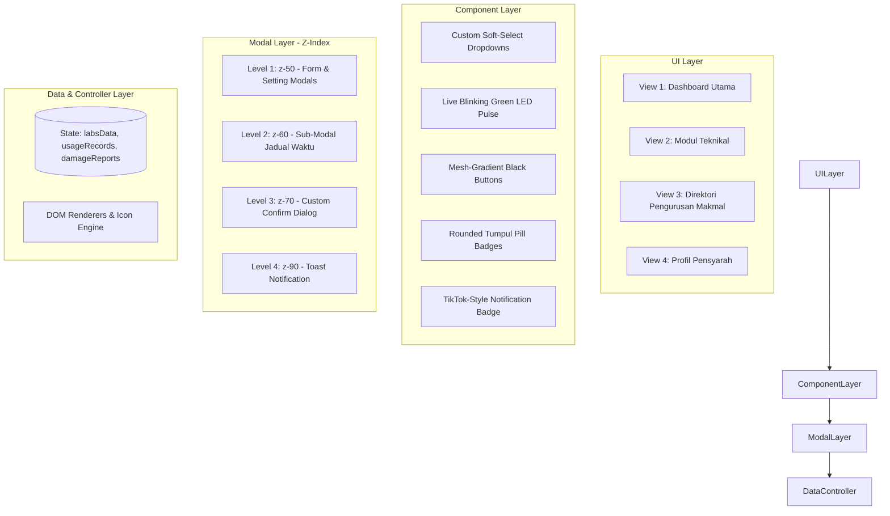

# 🛠️ SPESIFIKASI REKA BENTUK PERISIAN & SISTEM (SOFTWARE DESIGN & ARCHITECTURE)
# SisTrak Lab v3.0 — Sistem Penjejakan & Pengurusan Makmal Komputer

---

## 1. SENI BINA SISTEM & STRUKTUR FAIL

### 1.1 Komponen & Struktur Direktori (`lab-3/`)
Sistem dibina berasaskan seni bina web moden yang ringan, laju, dan modular tanpa beban *framework* luaran yang berat:

```
lab-3/
├── index.html           # Struktur semantik HTML5, modul view & komponen modal
├── style.css            # Tema Tailwind CSS tambahan, animasi, custom select & modal hierarchy
├── script.js            # Enjin data reaktif, event handlers, manipulasi DOM & sistem modal
├── jadual(default).png  # Fail imej jadual waktu makmal rasmi lalai
├── PRD.md               # Dokumen Keperluan Produk & Perancangan Ciri Baharu
└── SOFTWARE_DESIGN.md   # Spesifikasi Reka Bentuk, Sistem Komponen & Log Perubahan
```

### 1.2 Rajah Seni Bina Lapisan (Layered Architecture)


---

## 2. SISTEM REKA BENTUK MENYELURUH (DESIGN SYSTEM SPECIFICATION)

### 2.1 Palet Warna Rasmi (Color Palette)
Sistem menggunakan gabungan harmoni antara warna korporat pekat, oren ceria politeknik, dan warna penunjuk status standard antarabangsa:

| Token Warna | Kod Hex | Kelas Tailwind | Tujuan & Penggunaan |
|---|---|---|---|
| **Hitam Primer** | `#0f172a` | `bg-slate-900` / `btn-mesh-gradient` | Butang tindakan utama, tajuk tegas, teks angka metrik |
| **Hitam Border** | `#1e293b` | `border-slate-800` | Sempadan butang hitam, bayang-bayang kedalaman |
| **Oren Tema** | `#f97316` | `from-orange-500 to-amber-500` | Aksen sidebar, avatar profil, mesh gradient header |
| **Pic / Oren Lembut** | `#fff7ed` | `bg-orange-50 text-orange-600` | Hover state pada pilihan custom soft-select |
| **Hijau Zamrud (Tersedia)**| `#10b981` | `bg-emerald-500 / bg-emerald-50` | Lampu kelip status Tersedia, ikon tick butang Selesai |
| **Kuning Matahari (Digunakan)** | `#facc15` | `bg-yellow-400 / bg-yellow-50` | Status makmal Digunakan, kad metrik sesi aktif |
| **Ros / Merah (Kerosakan)**| `#f43f5e` | `bg-rose-500 / bg-rose-50` | Status Diselenggara, aduan kritikal, butang Padam Lab |
| **Ungu (Baru)** | `#a855f7` | `bg-purple-100 text-purple-800` | Lencana aduan baharu masuk |

### 2.2 Tipografi
- **Keluarga Font**: `Inter, -apple-system, BlinkMacSystemFont, 'Segoe UI', Roboto, sans-serif`
- **Skala Hierarki**:
  - **H1 / Display**: `24px` (Font-Black `900`) — Angka metric cards.
  - **H2 / H3**: `16px`–`14px` (Font-Extrabold `800`) — Tajuk modul dan tajuk modal.
  - **Body / Normal**: `12px` (Font-Semibold `600`) — Teks jadual, label butang, borang input.
  - **Micro / Subtitle**: `10px`–`11px` (Font-Bold `700`, Uppercase) — Kategori aras, kod tiket.

### 2.3 Komponen Antaramuka Kustom (Custom UI Components)

#### A. Custom Soft-Select Component (Anti-Petak Windows)
- **Masalah Asal**: Elemen `<select>` lalai pelayar Windows membuka menu bersudut tepat 90° yang keras dan merosakkan estetika moden.
- **Penyelesaian Seni Bina**:
  - Dibina menggunakan pembungkus `.custom-select-wrapper`, `<input type="hidden">`, butang pencetus `.custom-select-trigger`, dan menu terapung `.custom-select-options`.
  - Menggunakan `rounded-2xl` pada menu luaran, `shadow-xl` lembut, dan `rounded-xl` pada setiap pilihan item dengan sorotan pic oren cair (`hover:bg-orange-50 hover:text-orange-600`).
  - Dilengkapi *Click-Outside Event Listener* global yang menutup menu serta-merta apabila pengguna mengklik kawasan lain.

#### B. Live Blinking Green LED Pulse (Penunjuk Hidup Berkelip)
- Dihasilkan melalui gabungan gelung Tailwind `animate-ping` dan animasi CSS kustom `@keyframes liveGreenBlink`:
```css
@keyframes liveGreenBlink {
  0%, 100% { opacity: 1; transform: scale(1); box-shadow: 0 0 0 0 rgba(16, 185, 129, 0.7); }
  50% { opacity: 0.35; transform: scale(0.85); box-shadow: 0 0 8px 3px rgba(16, 185, 129, 0.45); }
}
.live-led-blink { animation: liveGreenBlink 1.4s ease-in-out infinite; }
```

#### C. Lencana Status Rounded Tumpul vs Butang Tindakan Segi Empat
- **Lencana Status**: Menggunakan `rounded-full` bulat tumpul (`px-3 py-0.5`) dengan teks kemas **tanpa sebarang bulatan hitam atau titik dalamannya**.
- **Butang Tindakan Selesai**: Menggunakan `btn-mesh-gradient rounded-xl` berbentuk segi empat tepat moden dengan ikon tanda semak (`check`) hijau zamrud cerah.

#### D. Dropup Menu Gaya ChatGPT (Bucu Kiri Bawah)
- Avatar profil diletakkan di sudut bawah kiri bar sisi navigasi.
- Menekan avatar akan memicu popup menu terapung ke atas (`dropup`) dengan animasi `dropupScaleUp`.

#### E. Komponen Jalur Pemilih Tarikh (Date Picker Strip) & Penapisan Rekod Dinamik
- **Penjajaran Berpusat**: Pengepala `"Date Picker Strip"`, pemilih bulan `"Ogos 2026"`, dan barisan butang hari dijajarkan di tengah-tengah paksi horizontal (*centered flex*).
- **Sistem Dwi-Tema Butang Tarikh**:
  - **Hari Ini (20 Ogos)**: Menggunakan kelas `.date-strip-btn.active-today` dengan kecerunan oren terang (`background: linear-gradient(135deg, #f97316 0%, #ea580c 100%)`, teks putih tebal, dan bayang oren). Sekiranya pengguna memilih tarikh lain, hari ini kekal bertema oren lembut menerusi kelas `.today-unselected` dengan sempadan oren dan titik penunjuk oren.
  - **Hari Lain yang Dipilih**: Menggunakan kelas `.date-strip-btn.active-other` dengan latar belakang hitam pekat korporat (`#0f172a`, teks putih, dan bayang gelap).
- **Logik Penapisan Penggunaan Makmal Dinamik**:
  - Model data `dailyUsageRecords` mengasingkan rekod mengikut hari kalendar (cth: 19 = sesi semalam selesai, 20 = log aktif semasa, 21–25 = tempahan masa hadapan).
  - Memilih tarikh akan memicu fungsi `renderUsageTable()` serta-merta tanpa muat semula halaman, mengemas kini teks tajuk kecil `#usageTableSubtitle`, dan menyusun sesi pengguna aktif di baris teratas.
- **Pembersihan Antaramuka**:
  - Membuang pemasa `hoverExpandTimer` 0.5 saat; kad makmal kini hanya berkembang apabila diklik secara fizikal oleh pengguna (`onclick="toggleLabExpandClick()"`).
  - Membuang input carian `#labSearchInput` bagi memastikan panel kanan kekal kemas dan tidak berselerak.

---

## 3. RANCANGAN SISTEM NOTIFIKASI TIKTOK-STYLE (UNTUK ADMIN)

### 3.1 Model Data Notifikasi
```javascript
let adminNotifications = [
  {
    id: "notif-01",
    ticketId: "TK-103",
    lab: "ILL 1",
    item: "Oscilloscope Ch-2 Rosak",
    severity: "Kritikal",
    reporter: "Pn. Rohana",
    timestamp: Date.now() - 120000, // 2 minit lalu
    isRead: false
  },
  // ... aduan lain
];
```

### 3.2 Struktur Komponen Notifikasi pada Sidebar
```html
<!-- Menu Teknikal dengan Lencana TikTok -->
<button onclick="handleTeknikalMenuClick()" class="nav-item relative w-full flex items-center justify-between p-3 rounded-2xl ...">
  <div class="flex items-center gap-3">
    <div class="relative">
      <i class="w-5 h-5 text-orange-500" data-lucide="wrench"></i>
      <!-- Lencana Nombor TikTok Merah Berdenyut -->
      <span id="tiktokNotifBadge" class="absolute -top-1.5 -right-2 bg-rose-500 text-white text-[10px] font-black w-4 h-4 rounded-full flex items-center justify-center ring-2 ring-white shadow-sm animate-pulse">
        3
      </span>
    </div>
    <span class="font-bold text-xs text-slate-700">Teknikal</span>
  </div>
</button>
```

---

## 4. LOG CATATAN PERUBAHAN MENYELURUH (COMPREHENSIVE CHANGELOG)

Semua permintaan dan perubahan yang telah dilaksanakan direkodkan secara terperinci mengikut urutan kronologi:

| Iterasi | Perubahan yang Diminta | Tindakan & Fail Terlibat | Status |
|---|---|---|---|
| **#01** | Alih menu profil ke bucu kiri bawah dengan konsep popup dropup ChatGPT | Mencipta `#chatgptProfileTrigger` dan `#chatgptProfileMenu` dalam `index.html`, animasi `.dropup-animated` dalam `style.css` | ✅ Selesai |
| **#02** | Tukar warna check-in ke oren, ikon pengurusan lab ke monitor, buang teks tapis aras bertindih, kembalikan status digunakan ke kuning | Mengemaskini ikon Lucide `monitor`, membetulkan margin penapis aras, menetapkan palet kuning `bg-yellow-400` untuk status Digunakan | ✅ Selesai |
| **#03** | Rekaan pengurusan lab ringkas rectangle, hanya paparkan status Diselenggara (buang status Tersedia dari kad), satukan ke ikon pensel | Merombak kad pengurusan lab di `script.js` (`renderManagementLabs`) menjadi kad ringkas dengan butang pensel dan padam | ✅ Selesai |
| **#04** | Buang teks "10 Makmal Ditunjukkan (10 Jumlah)" | Membuang elemen kaunter teks penyemak di bahagian atas direktori makmal | ✅ Selesai |
| **#05** | Padanan seragam kombinasi warna oren di sidebar dan butang hitam | Menetapkan kelas `.btn-mesh-gradient` untuk semua butang utama sistem berasaskan tema hitam pekat `#0f172a` | ✅ Selesai |
| **#06** | Tambah butang buang/padam lab | Menambah ikon `trash-2` pada kad makmal dan modal pensel berserta dialog pengesahan amaran | ✅ Selesai |
| **#07** | Baiki isu modal jadual bertindih di belakang skrin | Menetapkan hierarki Z-Index berlapis: Level 1 (z-50), Level 2 (z-60), Level 3 (z-70), Level 4 (z-90) | ✅ Selesai |
| **#08** | Hitamkan tajuk-tajuk metric cards (Keseluruhan, Tersedia, Digunakan, dsb.) | Menukar kelas tipografi tajuk kad metrik kepada `text-slate-900 font-black uppercase` | ✅ Selesai |
| **#09** | Penilaian Tailwind CSS vs Bootstrap 5 | Pengesyoran pengekalan Tailwind CSS bagi memelihara ketepatan micro-interactions dan layout | ✅ Selesai |
| **#10** | Baiki dropdown petak tajam pelayar Windows, buang button "Senarai Bertab", mansuhkan tab modal teknikal & bersihkan badge | Membina komponen `Custom Soft-Select`, membuang `Senarai Bertab`, memansuhkan tab duplikasi modal, dan membuang container badge | ✅ Selesai |
| **#11** | Kembalikan badge status, buang aksara '+' teks pendua pada butang Buka Borang Aduan dan Tambah Makmal Baharu | Mengembalikan badge status, membuang teks `+` yang bertindih dengan ikon bulat Lucide `plus-circle` | ✅ Selesai |
| **#12** | Buang teks "2 Laporan", tambah butang/lampu hijau kelip-kelip untuk Tersedia/Digunakan, dan ikon tick pada status Selesai | Memadam teks `2 Laporan`, menambah animasi `live-led-blink` + `animate-ping` untuk status Tersedia, menambah ikon check | ✅ Selesai |
| **#13** | Badge status berbentuk rounded tumpul tanpa bulatan hitam, butang Selesai di Tindakan berbentuk rectangle boleh klik, tukar nama butang kepada "Aduan" | Menukar badge status kepada `rounded-full` bersih tanpa dot, mereka butang `Selesai` di Tindakan dengan `btn-mesh-gradient rounded-xl`, menukar teks butang kepada `Aduan` | ✅ Selesai |
| **#14** | Buang lajur TIKET daripada jadual aduan teknikal | Membuang `<th>TIKET</th>` dalam `index.html` dan `<td>${t.id}</td>` dalam `renderDamageTable()` `script.js` | ✅ Selesai |
| **#15** | Buang teks "Hover 0.5s untuk kembang", buang Search input, letak Date Picker Strip dan Ogos 2026 ke tengah, tema warna tarikh harian (oren untuk hari ini, hitam untuk hari lain yang dipilih), dan penapisan rekod penggunaan makmal dinamik mengikut hari | Mengemaskini `index.html`, `style.css`, `script.js`, `PRD.md`, dan `SOFTWARE_DESIGN.md` | ✅ Selesai |
| **#16** | Tukar warna ikon jam metric card dashboard ke kuning seragam, kemaskini ikon metric card teknikal (Dalam Tindakan: wrench, Selesai: check-check), tukar nama Selesai Dibaikpulih ke Selesai sahaja | Mengemaskini `index.html`, `SOFTWARE_DESIGN.md`, dan `PRD.md` | ✅ Selesai |
